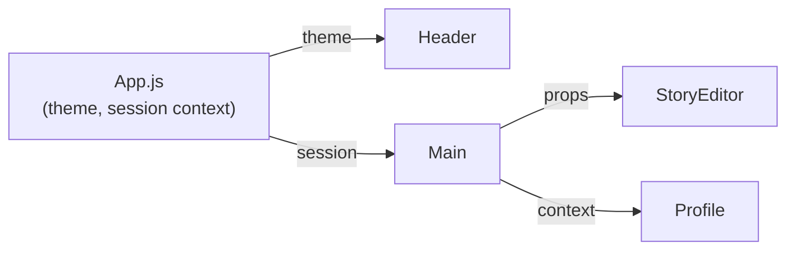
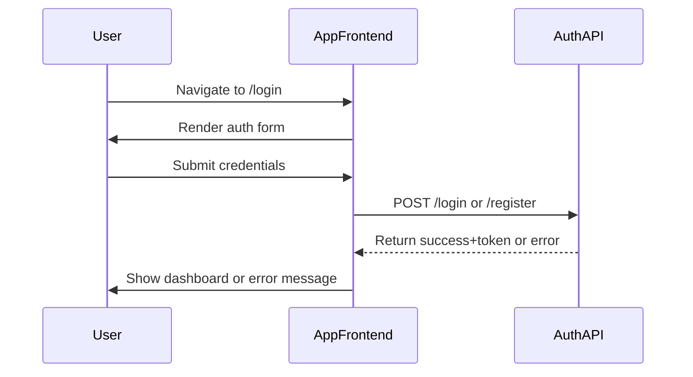
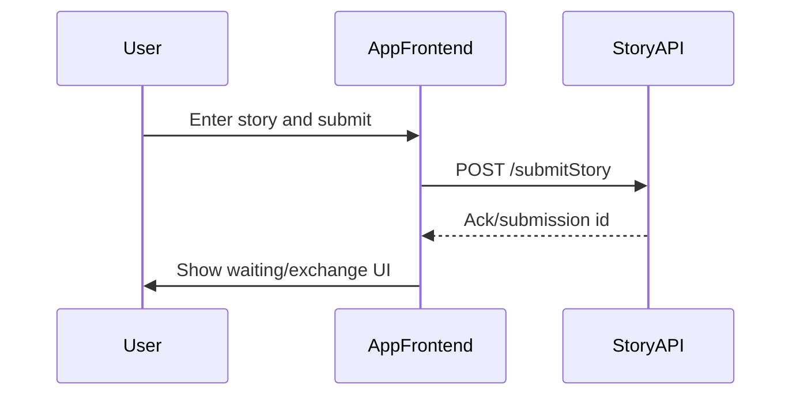
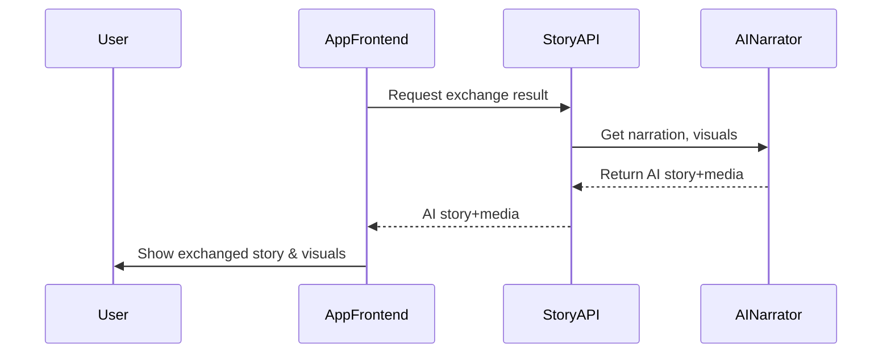

# Story Exchange Diary App: Frontend Architecture & Overview

## Introduction

The Story Exchange Diary App is a creative web application that allows users to write their own stories and, in return, receive a story from another user, enhanced with AI-powered narration and visuals. This document provides a high-level overview of the frontend React project, including its structure, feature set, design philosophy, component hierarchy, state management, routing, thematic styling, and user experience flows.

---

## 1. Project Purpose and Scope

- **Purpose**: Facilitate playful and meaningful story exchanges among users, utilizing AI to transform received stories into narrated, visually rich experiences.
- **Scope**: User-facing web application handling story composition, exchange, narration presentation, user account management, and story history.

---

## Rationale for Major Components

The architecture aims for a balance between rapid prototyping and extensibility. The initial codebase establishes a minimal, readable React SPA with explicit separation of concerns for future scaling. Key structural decisions:

- **Root App Structure**: Centralizes layout, theming, and future context providers.
- **Feature Modules (planned)**: Feature-driven folders (auth, story, profile) will isolate business logic and UI for each core user journey, lowering cognitive load.
- **Atomic UI Components (planned)**: Shared components (e.g., Button, Modal, ThemedContainer) ensure visual and behavioral consistency and reduce code duplication.

---

## 2. Key Features

- **User Authentication**: Secure registration, login, and session handling (to be implemented).
- **Story Writing & Submission**: Responsive editor for composing and submitting stories.
- **Exchanged AI-Narrated Stories**: Receiving a story from another user, enhanced by AI narration and visuals.
- **Visuals with Stories**: Display of AI-generated visuals paired with exchanged stories.
- **User Profile Management**: Interface for managing account details and settings.
- **History of Exchanged Stories**: Log of all sent and received stories for personal review.

---

## 3. Project Structure

The project follows a standard, modular React structure prioritizing clarity and maintainability.

```
app_frontend/
├── README.md
├── package.json
├── eslint.config.mjs
├── src/
│   ├── App.js          # Main application component & root logic
│   ├── App.css         # Theming, core styles, responsive breakpoints
│   ├── index.js        # React entry point
│   ├── index.css       # Global CSS resets & base fonts
│   ├── App.test.js     # App-level tests
│   └── setupTests.js   # Jest DOM setup
└── kavia-docs/
    └── ARCHITECTURE_OVERVIEW.md  # (this documentation)
```

### Planned Structure (Component-based, to expand with feature implementation)

- `components/`: Common reusable components (Button, Navbar, Modal, etc.)
- `features/`: Feature-driven folders for auth, story exchange, profiles, etc.
- `routes/`: Routing and view-level logic
- `contexts/` or `store/`: (If app state becomes complex; for React Context or Redux)

---

## 4. Component Hierarchy & Main App Flow

The core app initializes in `App.js`, which manages theme selection and provides the global application layout.

### Example Hierarchy


*Planned components/functions. Only theme logic and basic layout exist in the current code.*

---

## 5. State Management

### Current State

- **Local State with Hooks**: Theme is managed with `useState` and tied to a `data-theme` attribute for global styling:
  ```js
  const [theme, setTheme] = useState('light');
  useEffect(() => {
    document.documentElement.setAttribute('data-theme', theme);
  }, [theme]);
  ```
  This use-case demonstrates "local-global" state: it originates in the App component but globally affects the CSS context.

### Planned State (Scaling)

- **Component Props**: Data flows down for simple components (e.g., a child ThemeToggle receives props).
- **React Context**: When user authentication/session or global story objects are added, they'll be managed via the Context API, providing easy access to user info or UI state throughout the tree.
- **Redux or Zustand**: Only adopted if state logic becomes complex (e.g., optimistic UI updates across different views, or caching/pagination for large story logs).
- **API Data**: State from backend APIs (story lists, profile) would be fetched via `useEffect`, stored in context or reducer, and refreshed on key interactions.

#### Example (State Distribution - Planned)


#### Error & Edge Handling in State
- **Theme**: Defaults to light, fallback in case of read failure.
- **Auth**: Session expiry/invalid tokens prompt logout and redirect.
- **Stories/API**: API errors would show inline error banners (planned).

---

## 6. Routing

**(Currently not implemented)**

- **React Router** (planned): To enable navigation between authentication, dashboard, story submission, results, profile, and history pages.
- **Routing Structure** (planned):
  ```
  /login           # Auth page
  /dashboard       # Main story exchange area
  /write           # Submit a new story
  /exchange/:id    # View received, AI-narrated story
  /profile         # User profile management
  /history         # Sent/received stories
  ```

---

## 7. Theming and Visual Style

### Theming & Color Variable Structure

The project employs **CSS custom properties** (`:root` and `[data-theme="dark"]`) defined in `App.css`. This enables dynamic theming and clean visual separation for light/dark modes.

#### Sample Variable Declarations (App.css)
```css
:root {
  --bg-primary: #ffffff;        /* Main background */
  --bg-secondary: #f8f9fa;     /* Header/section backgrounds */
  --text-primary: #282c34;     /* Main text */
  --text-secondary: #61dafb;   /* Links, accents */
  --border-color: #e9ecef;     /* Borders and dividers */
  --button-bg: #007bff;        /* Main UI buttons */
  --button-text: #ffffff;
}
/* Dark theme override */
[data-theme="dark"] {
  --bg-primary: #1a1a1a;
  --bg-secondary: #282c34;
  --text-primary: #ffffff;
  --text-secondary: #61dafb;
  --border-color: #404040;
  --button-bg: #0056b3;
  --button-text: #ffffff;
}
```
**Theme Toggle**: Triggered via a UI button in the app header, supports seamless transitions.

#### Project Brand Colors (Planned/Future)
In addition to current variables, future releases may introduce (from `container_details.colors`):
- `--color-primary: #4F46E5;`
- `--color-secondary: #22D3EE;`
- `--color-accent: #A78BFA;`
These would be used for calls-to-action, avatars, or story highlights.

#### Theming Logic
- CSS variables are referenced throughout all styles. Changing theme updates all UI in-place.
- Responsive breakpoints are defined for mobile usability (`@media` rules, see `App.css`).
- **Accessibility:** Ensuring color contrasts meets AA/AAA guidelines.

---

### Visual Component Patterns

#### Example: Reusable Button Component (planned)
```jsx
function Button({ children, onClick, type='button', styleType }) {
  return (
    <button className={`btn${styleType ? ' btn-' + styleType : ''}`} onClick={onClick} type={type}>
      {children}
    </button>
  );
}
```
By relying on class-based styling, visual consistency is maintained; future button types (primary, secondary) can be supported with only CSS updates.

---

### Responsive Design

- **Mobile adaptation**: Layouts adapt for mobile-first. The theme toggle and primary actions are structured for large touch targets.
- **CSS Classes**: Core UI classes include `.App`, `.App-header`, `.theme-toggle`, `.container` (planned), following BEM/minimal conventions.

---

## 8. Visual & UX Guidelines

- **Modern & Minimalistic**: Few visual distractions. Emphasis on story text and visuals, not chrome.
- **White Space**: Strategic use to increase readability and focus on user content.
- **Accessible Color Contrast**: All text and interactive elements designed for minimum AA accessibility contrast, adjustable for modes.
- **Large, Touchable Controls**: Story writing and navigation optimised for both keyboard and mobile tap.
- **Smooth Transitions**: Subtle transitions for theme and navigation (CSS transitions used in theme toggle).
- **Friendly, Calm Atmosphere**: Use of blue and purple accents (planned) to create a creative, safe environment.

---

## 9. Main User Flows (Planned & Expanded)

### Authentication (Login/Registration)

#### Step-by-Step
1. User lands on `/login`.
2. Chooses "Register" (if new) or "Sign In" (existing).
3. Inputs credentials.
4. On success, session token is stored (typically in-memory or via cookie).
5. Navigates to `/dashboard`.

#### Sequence Diagram

> **Edge cases:** Invalid credentials, network errors, session expiry.

---

### Story Writing & Submission

#### Step-by-Step
1. User navigates `/write`.
2. Inputs story in a large text area (with live validation - planned).
3. Clicks "Submit".
4. Submission triggers POST to Exchange API (planned).
5. On success, show a loader or transition view.

#### Sequence Diagram

> **Edge cases:** Empty or profane story; submission too long.

---

### Exchange & AI-Narration Delivery

#### Step-by-Step
1. After submit, backend returns an "exchange result" or polls until ready.
2. App fetches AI-narrated story and associated visuals.
3. User is shown received story, narration UI, and image (planned).

#### Sequence Diagram

> **Edge cases:** Delay in AI generation, failed media fetch, story flagged as inappropriate.

---

### Profile & History

#### Step-by-Step
1. User visits `/profile` or `/history`.
2. App fetches user data or story logs and displays as lists.
3. User can update profile (e.g., email, display name - planned).

---

## 10. Example API Structure & Error Handling

### API Interaction (Planned/Stubbed Example)

API calls are not yet implemented, but the standard pattern will follow `fetch` or a light HTTP client. Each call will handle authentication headers and errors gracefully.

**Example: Story Submission (future logic)**
```js
async function submitStory(storyText, token) {
  const res = await fetch('/api/v1/exchange/submit', {
    method: 'POST',
    headers: {
      'Content-Type': 'application/json',
      'Authorization': `Bearer ${token}`
    },
    body: JSON.stringify({ story: storyText })
  });
  if (!res.ok) {
    throw new Error('Story submission failed.');
  }
  return res.json();
}
```
> **Anticipated Error Scenarios:**
> - Invalid/expired token (prompts logout and re-auth)
> - Network timeouts (shows banner/toast)
> - Backend validation errors (shows field validation messages)

### Component Collaboration & Data Flow

- **Top-down Data**: App passes theme and (eventually) session context down; page components responsible for their own fetch/lifecycle.
- **Uplift Events**: Child components (e.g., story submission) call parent handlers or update global state/context.
- **Loose coupling**: Future modularity will encourage isolated side effects (i.e., only background API polling/listeners where needed).

### Edge-cases & Robustness

- **Failed Requests**: User feedback via banners or toasts for all failures, fallback guidance.
- **Lost Session**: App detects expired sessions and auto-logs the user out.
- **Visual/AI Delays**: Detects backend timeouts and offers retry or alternative guidance.
- **Theming Issues**: Theme always falls back to light; toggling protected by state (cannot get out of sync).
- **Input Validation**: Story forms will have client-side and server-side validation (future).

---

## 11. References

- [React Documentation](https://reactjs.org/)
- See `README.md` and `App.css` for technical details on current setup.

---

## 12. Appendix: Current File Index

| File/Folder         | Purpose                                      |
|---------------------|----------------------------------------------|
| `src/App.js`        | Main app logic, theme management, layout     |
| `src/App.css`       | Core styles, CSS variables, responsive rules |
| `src/index.js`      | App entry point                              |
| `src/index.css`     | Base styles and resets                       |
| `src/App.test.js`   | Basic smoke test                             |
| `src/setupTests.js` | Testing framework setup                      |

---

## 13. Architecture Diagram (Conceptual)

```mermaid
graph LR
  Client[User Web Browser]
  Client -->|HTTPS| AppFrontend[React SPA App<br/>(App.js, components)]
  AppFrontend -- ThemeContext --> Styles[CSS Variables<br/>App.css]
  AppFrontend -- (planned: Router) --> Views[Page Components:<br/>Auth, Dashboard, Exchange, Profile]
  AppFrontend -- (planned: API Integration) --> Backend[Backend Server/API*]
```

---

## Summary

This React project sets the foundation for a modern, scalable story exchange platform, utilizing minimal boilerplate and a lightweight design system ready for future component and feature expansion. As development progresses, component modularity, routing, and sophisticated state management will be layered in to support the rich, creative workflows described above.
