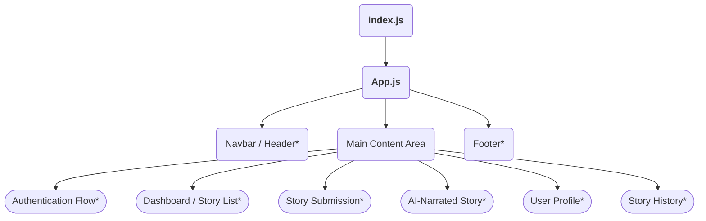

# Story Exchange Diary App: Frontend Architecture & Overview

## Introduction

The Story Exchange Diary App is a creative web application that allows users to write their own stories and, in return, receive a story from another user, enhanced with AI-powered narration and visuals. This document provides a high-level overview of the frontend React project, including its structure, feature set, design philosophy, component hierarchy, state management, routing, thematic styling, and user experience flows.

---

## 1. Project Purpose and Scope

- **Purpose**: Facilitate playful and meaningful story exchanges among users, utilizing AI to transform received stories into narrated, visually rich experiences.
- **Scope**: User-facing web application handling story composition, exchange, narration presentation, user account management, and story history.

---

## 2. Key Features

- **User Authentication**: Secure registration, login, and session handling (to be implemented).
- **Story Writing & Submission**: Responsive editor for composing and submitting stories.
- **Exchanged AI-Narrated Stories**: Receiving a story from another user, enhanced by AI narration and visuals.
- **Visuals with Stories**: Display of AI-generated visuals paired with exchanged stories.
- **User Profile Management**: Interface for managing account details and settings.
- **History of Exchanged Stories**: Log of all sent and received stories for personal review.

---

## 3. Project Structure

The project follows a standard, modular React structure prioritizing clarity and maintainability.

```
app_frontend/
├── README.md
├── package.json
├── eslint.config.mjs
├── src/
│   ├── App.js          # Main application component & root logic
│   ├── App.css         # Theming, core styles, responsive breakpoints
│   ├── index.js        # React entry point
│   ├── index.css       # Global CSS resets & base fonts
│   ├── App.test.js     # App-level tests
│   └── setupTests.js   # Jest DOM setup
└── kavia-docs/
    └── ARCHITECTURE_OVERVIEW.md  # (this documentation)
```

### Planned Structure (Component-based, to expand with feature implementation)

- `components/`: Common reusable components (Button, Navbar, Modal, etc.)
- `features/`: Feature-driven folders for auth, story exchange, profiles, etc.
- `routes/`: Routing and view-level logic
- `contexts/` or `store/`: (If app state becomes complex; for React Context or Redux)

---

## 4. Component Hierarchy & Main App Flow

The core app initializes in `App.js`, which manages theme selection and provides the global application layout.

### Example Hierarchy


*Planned components/functions. Only theme logic and basic layout exist in the current code.*

---

## 5. State Management

### Current State
- **useState, useEffect**: The main app uses React local state for theme management:
  ```js
  const [theme, setTheme] = useState('light');
  ```
  The selected theme is applied via a `data-theme` attribute on the root document element.

### Future State / Scaling Plan
- **Local component state** for small features (forms, toggles, etc.).
- If global user data, session, or story objects grow:
  - **React Context API**: For lightweight sharing of auth/session info across components.
  - **Redux** (or light alternatives): To be considered if complex state interaction arises.

---

## 6. Routing

**(Currently not implemented)**

- **React Router** (planned): To enable navigation between authentication, dashboard, story submission, results, profile, and history pages.
- **Routing Structure** (planned):
  ```
  /login           # Auth page
  /dashboard       # Main story exchange area
  /write           # Submit a new story
  /exchange/:id    # View received, AI-narrated story
  /profile         # User profile management
  /history         # Sent/received stories
  ```

---

## 7. Theming and Visual Style

### Theming

- **CSS Variables**: The app uses CSS custom properties to support light and dark themes, defined in `App.css`.
- **Theme Toggle**: Users can switch between light/dark mode via a prominent button.
- **Color Palette**:
  - Light theme: white backgrounds, deep blue text (`#282c34`), accent blue (`#61dafb`)
  - Dark theme: near-black backgrounds (`#1a1a1a`), white text, accent blue
  - Project-branded colors (planned): Intended to include highlight colors (`#4F46E5`, `#22D3EE`, `#A78BFA`) for calls-to-action and accent highlights.

### Responsive Design

- **Mobile adaptation**: All layout and components should scale for mobile touch targets and smaller screens, as outlined in `App.css`.
- **CSS classes**:
  - `.App`, `.App-header`, `.theme-toggle`, `.container`, etc.

---

## 8. Visual & UX Guidelines

- **Modern & Minimalistic**: Few visual distractions. Emphasis on story text and visuals, not chrome.
- **White Space**: Strategic use to increase readability and focus on user content.
- **Accessible Color Contrast**: All text and interactive elements designed for minimum AA accessibility contrast, adjustable for modes.
- **Large, Touchable Controls**: Story writing and navigation optimised for both keyboard and mobile tap.
- **Smooth Transitions**: Subtle transitions for theme and navigation (CSS transitions used in theme toggle).
- **Friendly, Calm Atmosphere**: Use of blue and purple accents (planned) to create a creative, safe environment.

---

## 9. Main User Flows (Planned)

### 1. Authentication
- User accesses entry page, chooses to **register or login**.
- (Session persists after login until logout.)

### 2. Story Writing & Submission
- User enters story composition interface.
- Submits a written story.

### 3. Exchange & AI-Narration
- Upon submission, user receives an exchanged, AI-narrated story.
- The story is displayed with accompanying visuals.

### 4. Profile & History
- User may view and edit their profile.
- User may browse through sent and received stories in `History`.

---

## 10. Extensibility & Future Enhancements

- **Componentization**: One component per file, strong separation of concerns, supports testability.
- **Theming Support**: Easily expandable to support additional color schemes or accessibility modes.
- **Routing**: Set up for page-by-page expansion as features are developed.
- **Integrations**: Hooks for integrating API services for auth, story exchange, and AI rendering.

---

## 11. References

- [React Documentation](https://reactjs.org/)
- See `README.md` and `App.css` for technical details on current setup.

---

## 12. Appendix: Current File Index

| File/Folder         | Purpose                                      |
|---------------------|----------------------------------------------|
| `src/App.js`        | Main app logic, theme management, layout     |
| `src/App.css`       | Core styles, CSS variables, responsive rules |
| `src/index.js`      | App entry point                              |
| `src/index.css`     | Base styles and resets                       |
| `src/App.test.js`   | Basic smoke test                             |
| `src/setupTests.js` | Testing framework setup                      |

---

## 13. Architecture Diagram (Conceptual)

```mermaid
graph LR
  Client[User Web Browser]
  Client -->|HTTPS| AppFrontend[React SPA App<br/>(App.js, components)]
  AppFrontend -- ThemeContext --> Styles[CSS Variables<br/>App.css]
  AppFrontend -- (planned: Router) --> Views[Page Components:<br/>Auth, Dashboard, Exchange, Profile]
  AppFrontend -- (planned: API Integration) --> Backend[Backend Server/API*]
```

---

## Summary

This React project sets the foundation for a modern, scalable story exchange platform, utilizing minimal boilerplate and a lightweight design system ready for future component and feature expansion. As development progresses, component modularity, routing, and sophisticated state management will be layered in to support the rich, creative workflows described above.
